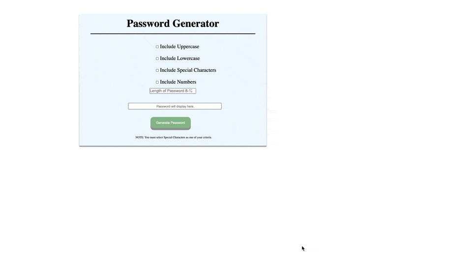

# Overview
The emphasis of this project was primarily getting javascript to run data validation, looping through different arrays, and finally generating a random password based
on the selected criteria. 

## Click [here](https://paynejoshua.github.io/Password-Generator/) for a live demo

## User Story
As consumers of the internet there are many websites that require a secure password. It can be difficult to come up with something that is secure and meets the requirements that websites are requiring. Consumers should be able to:
1. Check off different criteria that most websites require
2. Select how many characters the password should have
3. Based on the criteria checked off a password is randomly generated

## How to use
1. Begin by selecting the criteria that you would like
2. Select how many characters you would like the password to be
3. Select Generate Password
4. Copy and Paste the generated password into the site that you are signing up for.

## Development Process

I started off by writing some pseudo code for all of my files (HTML, CSS, and JavaScript) to gain a full scope of what I would need for each one. 

For JavaScript I knew I had to write out a script that would get certain elements in order to build arrays for those elements. I then laid out what arrays I would need to build and then from there I started creating my for loops and conditional statements. 

Enjoy!

## Technologies Used
1. HTML
2. CSS
3. JavaScript
